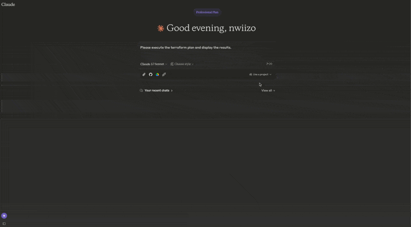

# tfmcp: Terraform Model Context Protocol Tool

*⚠️  This project is experimental. Features may change without notice. Use with caution! ⚠️*

tfmcp is a command-line tool that helps you interact with Terraform via the Model Context Protocol (MCP). It allows LLMs to manage and operate your Terraform environments, including:

## 🎮 Demo

See tfmcp in action with Claude Desktop:



- Reading Terraform configuration files
- Analyzing Terraform plan outputs
- Applying Terraform configurations
- Managing Terraform state
- Creating and modifying Terraform configurations

## 🎉 Latest Release

The first stable release of tfmcp (v0.1.1) is now available on Crates.io! You can easily install it using Cargo:

```bash
cargo install tfmcp
```

## Features

- 🚀 **Terraform Integration**  
  Deeply integrates with the Terraform CLI to analyze and execute operations.

- 📄 **MCP Server Capabilities**  
  Runs as a Model Context Protocol server, allowing AI assistants to access and manage Terraform.

- ⚡️ **Blazing Fast**  
  High-speed processing powered by the Rust ecosystem.

- 🛠️ **Automatic Setup**  
  Automatically creates sample Terraform projects when needed, ensuring smooth operation even for new users.

## Installation

### From Source
```bash
# Clone the repository
git clone https://github.com/nwiizo/tfmcp
cd tfmcp

# Build and install
cargo install --path .
```

### From Crates.io
```bash
cargo install tfmcp
```

## Requirements

- Rust (edition 2021)
- Terraform CLI installed and available in PATH
- Claude Desktop (for AI assistant integration)

## Usage

```bash
$ tfmcp --help
✨ A CLI tool to manage Terraform configurations and operate Terraform through the Model Context Protocol (MCP).

Usage: tfmcp [OPTIONS] [COMMAND]

Commands:
  mcp       Launch tfmcp as an MCP server
  analyze   Analyze Terraform configurations
  help      Print this message or the help of the given subcommand(s)

Options:
  -c, --config <PATH>    Path to the configuration file
  -d, --dir <PATH>       Terraform project directory
  -V, --version          Print version
  -h, --help             Print help
```

### Integrating with Claude Desktop

To use tfmcp with Claude Desktop:

1. If you haven't already, install tfmcp:
   ```bash
   cargo install tfmcp
   ```

2. Find the path to your installed tfmcp executable:
   ```bash
   which tfmcp
   ```

3. Add the following configuration to `~/Library/Application\ Support/Claude/claude_desktop_config.json`:

```json
{
  "mcpServers": {
    "tfmcp": {
      "command": "/path/to/your/tfmcp",  // Replace with the actual path from step 2
      "args": ["mcp"],
      "env": {
        "HOME": "/Users/yourusername",  // Replace with your username
        "PATH": "/usr/local/bin:/usr/bin:/bin:/usr/sbin:/sbin",
        "TERRAFORM_DIR": "/path/to/your/terraform/project"  // Optional: specify your Terraform project
      }
    }
  }
}
```

4. Restart Claude Desktop and enable the tfmcp tool.

5. tfmcp will automatically create a sample Terraform project in `~/terraform` if one doesn't exist, ensuring Claude can start working with Terraform right away. The sample project is based on the examples included in the `example/demo` directory of this repository.

## Logs and Troubleshooting

The tfmcp server logs are available at:
```
~/Library/Logs/Claude/mcp-server-tfmcp.log
```

Common issues and solutions:

- **Claude can't connect to the server**: Make sure the path to the tfmcp executable is correct in your configuration
- **Terraform project issues**: tfmcp automatically creates a sample Terraform project if none is found
- **Method not found errors**: MCP protocol support includes resources/list and prompts/list methods

## Environment Variables

- `TERRAFORM_DIR`: Set this to specify a custom Terraform project directory. If not set, tfmcp will use the directory provided by command line arguments, configuration files, or fall back to `~/terraform`. You can also change the project directory at runtime using the `set_terraform_directory` tool.
- `TFMCP_LOG_LEVEL`: Set to `debug`, `info`, `warn`, or `error` to control logging verbosity.
- `TFMCP_DEMO_MODE`: Set to `true` to enable demo mode with additional safety features.

## Security Considerations

When using tfmcp, please be aware of the following security considerations:

- tfmcp executes Terraform commands on your behalf, which can create, modify, or destroy infrastructure
- In production environments, consider using appropriate IAM permissions and role boundaries
- Review all Terraform plans before applying them, especially when generated by an AI
- Sensitive information in your Terraform state might be accessible to the AI assistants

## Contributing

Contributions are welcome! Please feel free to submit a Pull Request.

1. Fork the repository
2. Create your feature branch (`git checkout -b feature/amazing-feature`)
3. Commit your changes (`git commit -m 'Add some amazing feature'`)
4. Push to the branch (`git push origin feature/amazing-feature`)
5. Open a Pull Request

## Roadmap

Here are some planned improvements and future features for tfmcp:

### Completed
- [x] **Basic Terraform Integration**  
  Core integration with Terraform CLI for analyzing and executing operations.

- [x] **MCP Server Implementation**  
  Initial implementation of the Model Context Protocol server for AI assistants.

- [x] **Automatic Project Creation**  
  Added functionality to automatically create sample Terraform projects when needed.

- [x] **Claude Desktop Integration**  
  Support for seamless integration with Claude Desktop.

- [x] **Core MCP Methods**  
  Implementation of essential MCP methods including resources/list and prompts/list.

- [x] **Error Handling Improvements**  
  Better error handling and recovery mechanisms for robust operation.

- [x] **Dynamic Project Directory Switching**  
  Added ability to change the active Terraform project directory without restarting the service.

- [x] **Crates.io Publication**  
  Published the package to Crates.io for easy installation via Cargo.

### In Progress
- [ ] **Enhanced Terraform Analysis**  
  Implement deeper parsing and analysis of Terraform configurations, plans, and state files.

- [ ] **Multi-Environment Support**  
  Add support for managing multiple Terraform environments, workspaces, and modules.

- [ ] **Security Enhancements**  
  Improve security features including better authentication and authorization mechanisms.

- [ ] **Expanded MCP Protocol Support**  
  Implement additional MCP methods and capabilities for richer integration with AI assistants.

- [ ] **Interactive TUI**  
  Develop a terminal-based user interface for easier local usage and debugging.

- [ ] **Cost Estimation**  
  Integrate with cloud provider pricing APIs to provide cost estimates for Terraform plans.

- [ ] **Performance Optimization**  
  Optimize resource usage and response times for large Terraform projects.

- [ ] **Integration with Other AI Platforms**  
  Extend beyond Claude to support other AI assistants and platforms.

- [ ] **Comprehensive Testing Framework**  
  Expand test coverage including integration tests with real Terraform configurations.

- [ ] **Plugin System**  
  Develop a plugin architecture to allow extensions of core functionality.

## License

This project is licensed under the MIT License - see the [LICENSE](LICENSE) file for details.
